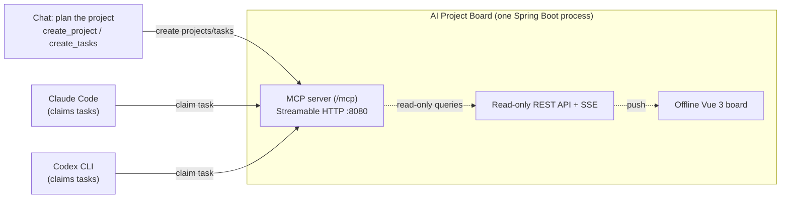

# AI Project Board

繁體中文說明見 [README.md](README.md)（完整版，含角色 agent 與工具治理）。

A local MCP server for AI coding agents. Agents write their progress to a board;
you watch every project's state in the browser instead of staring at several
terminals.




Plan a project in chat and break it into task cards. Then, inside any project's
repo, tell Claude Code or Codex to "claim tasks for {project}": the main session
dispatches unblocked work to idle role agents (backend / frontend / qa / infra /
docs). Each role works on one task at a time; results land on `dev` first, and a
reviewer approves the batch before it merges to `main`. Keep the browser open and
the board updates live over SSE.

## Requirements

- JDK 21 (`bin/board start` detects it and prints platform-specific install
  instructions if missing)
- No Maven install needed — the bundled `./mvnw` wrapper is used

## Quick start

```bash
./bin/board start
```

That single command finds JDK 21, resolves the database path, checks the port,
detects a stale H2 lock file, takes a pre-start backup, and builds the jar on
first run if `target/*.jar` is missing (this first build downloads Maven
dependencies and can take a few minutes). When you see
`看板已就緒：http://127.0.0.1:8080`, open that address in a browser.

Service lifecycle:

```bash
bin/board start      # start (detached from the terminal)
bin/board status     # PID, port, /api/health version info
bin/board stop       # SIGTERM, waits for the shutdown backup to finish
bin/board restart
bin/board logs       # tail -f the log file
```

On Windows, use the PowerShell equivalents (same defaults, same backup and
retention behaviour):

```powershell
.\bin\board.ps1 start
.\bin\board.ps1 status
.\bin\board.ps1 stop            # sends CTRL_C_EVENT so the shutdown backup runs
.\bin\board.ps1 restart
.\bin\board.ps1 logs -Lines 200
.\bin\board.ps1 start -Foreground   # run in this window to debug startup failures
```

`stop` never escalates to `SIGKILL` on its own — that would skip the consistent
shutdown backup. Pass `--force` if you really need to kill the process.

The board is empty on first launch. That is expected: projects and tasks can only
be created through MCP tools, the REST endpoints are read-only, and there is no
seed data. The UI shows the three steps to get your first card.

## Wiring it up

Claude Code (not needed if you installed the plugin — see below):

```bash
claude mcp add --transport http board http://127.0.0.1:8080/mcp --scope project
```

Codex (`~/.codex/config.toml`):

```toml
[mcp_servers.board]
url = "http://127.0.0.1:8080/mcp"
```

Both editors can also install this repo as a plugin, which wires the MCP endpoint,
six role agent shells and the `claim-tasks` skill in one step:

```bash
claude plugin marketplace add /path/to/AIProjectDashboard
claude plugin install ai-project-board@ai-board
```

See [docs/installation.md](docs/installation.md) for the full installation guide
(currently in Chinese).

## MCP tools

| Tool | Purpose |
|---|---|
| `create_project(name, description?)` | Create a project; names are trimmed and matched case-insensitively, returning the existing project on a duplicate |
| `create_tasks(projectId, tasks[])` | Insert 1–50 tasks; titles up to 300 chars; `dependsOnIndexes` / `dependsOnTaskIds` declare prerequisites |
| `list_tasks(projectId?/projectName?, status?, category?, includeDescription?)` | List tasks and progress |
| `claim_next_task(projectName, category, assignee)` | Atomically claim the earliest TODO task whose prerequisites are all DONE |
| `block_task(taskId, claimToken?, reasonType, detail, blockingTaskIds?, expectedVersion?)` | Mark your claimed task BLOCKED with a structured reason |
| `complete_task(taskId, claimToken?, summary, verificationResults, changedFiles?, commitRef?, expectedVersion?)` | Complete your claimed task with evidence; works from `IN_PROGRESS` or `BLOCKED` |
| `update_task_status(taskId, status, note?, claimToken?)` | Compatible status entry point; resume/release map to `IN_PROGRESS`/`TODO` |
| `reset_task_claim(taskId, note?)` | Leader only: reset a claim when a worker loses its token |
| `preview_archive_project` / `archive_project` / `restore_project` | Leader only, and only on explicit user request in the current conversation |
| `update_task_details` / `set_task_dependencies` | Leader only: edit spec or prerequisites of TODO/BLOCKED tasks |
| `list_roles` / `get_role` / `upsert_role` | Role instructions live in the board's database, not in files |

Categories: `BACKEND` / `FRONTEND` / `TEST` / `INFRA` / `DOC` / `OTHER`. Unknown or
blank values normalise to `OTHER`, so no task becomes unclaimable.

REST endpoints are read-only; every write goes through MCP:
`/api/projects`, `/api/projects/{id}/board`,
`/api/projects/{id}/tasks/{taskId}/history`, `/api/roles`, `/api/events` (SSE),
`/api/health`, `/api/health/live`, `/api/health/ready`, `/api/diagnostics`.

## Security model

Read this before exposing the board to anything beyond your own machine.

- **No server-side authentication.** Any process that can reach `/mcp` can call
  every tool, including `archive_project`. The worker tool allowlists enforced by
  Claude Code / Codex are a client-side boundary, not server authorisation.
- **Binds to `127.0.0.1` by default** (`BOARD_HOST`).
- **Host / Origin validation** blocks DNS rebinding: a malicious page that points
  its own domain at `127.0.0.1` would otherwise be same-origin with the board and
  could drive `/mcp` from your browser. Requests whose `Host` or `Origin` is not
  loopback are rejected with `403`. To deliberately allow another host (LAN
  address, reverse proxy), list it in `BOARD_ALLOWED_HOSTS`
  (comma-separated) — this grants access, it does not add authentication.
- `/api/diagnostics` returns paths, disk usage and backup state. It has no access
  control; treat it as trusted-user-only.
- No cloud or server deployment path is provided or validated. If you must expose
  the board, put your own authentication layer (reverse proxy with Basic Auth or
  mTLS) in front of it.

## Backups and restore

- **Before startup**: `bin/backup-db.sh` copies the database file (verified by
  size and H2 MVStore magic bytes) before Flyway migrations run. A failed backup
  aborts startup.
- **Before shutdown**: `ShutdownBackupService` runs H2's `BACKUP TO` on
  `ContextClosedEvent` (SIGTERM, Ctrl+C, normal JVM shutdown) for a consistent
  snapshot. `kill -9`, JVM crashes and power loss cannot trigger it.
- **While running**: `ScheduledBackupService` takes a consistent snapshot every
  6 hours by default (`BOARD_BACKUP_INTERVAL`, disable with
  `BOARD_BACKUP_SCHEDULE_ENABLED=false`). This is the only backup that fires
  during a long-running process between starts and stops.
- **Retention**: each of the three backup phases (startup/shutdown/scheduled)
  has its own quota so frequent scheduled snapshots cannot crowd out the
  shutdown snapshot. Backups newer than 30 days are always kept; older ones
  are only deleted while at least 7 remain in that phase's bucket.
- **Restore**: `bin/restore-db.sh --list`, then
  `bin/restore-db.sh latest` (or a specific file); on Windows,
  `.\bin\restore-db.ps1 -List` and `.\bin\restore-db.ps1 latest`. It refuses to run while the
  board is up, preserves the current database as `.pre-restore-<UTC>` instead of
  deleting it, and verifies the restored file before committing the rename.

See [docs/operations.md](docs/operations.md) for the operational runbook.

## Configuration

| Variable | Default | Purpose |
|---|---|---|
| `BOARD_PORT` | `8080` | HTTP port |
| `BOARD_HOST` | `127.0.0.1` | Bind address |
| `BOARD_ALLOWED_HOSTS` | (empty) | Extra hosts accepted by the Host/Origin guard |
| `BOARD_DB_URL` | `jdbc:h2:file:<data-dir>/board` | H2 database |
| `BOARD_HOME_DIR` | `~/.ai-project-board` | Data, backups and PID file |
| `BOARD_LOG_FILE` | `<repo>/logs/board.log` | Log file (daily/10MB rotation, gzip) |
| `BOARD_BACKUP_DIR` | `<BOARD_HOME_DIR>/backups` | Backup output |
| `BOARD_PID_FILE` | `<BOARD_HOME_DIR>/board.pid` | PID file used by `bin/board` |
| `BOARD_STOP_TIMEOUT_SEC` | `60` | How long `stop` waits for shutdown |

This is a subset covering the common cases. The full list (SSE limits, log
rotation, backup retention counts, etc.) is in the "設定" section of
[README.md](README.md#7-設定).

## Development

```bash
BOARD_PORT=8081 BOARD_DB_URL='jdbc:h2:file:./data/dev-local' ./mvnw test
```

Never run tests or a dev instance against `:8080` or the default database — that
is the user's live board. Development rules for agents are in
[AGENTS.md](AGENTS.md).

Stack: Spring Boot 4.1.0, Spring AI 2.0.0 (MCP, Streamable HTTP), Java 21, H2,
Flyway, Vue 3 (no build step; the Vue runtime and fonts are vendored into the repo
so the UI works fully offline).

## Known limitations

- Single machine only; no cross-device sync, no cloud deployment path is
  provided or validated
- No server-side authentication on `/mcp` (see the security model above)
- The SSE registry is a single in-process singleton; no horizontal scaling
- Role instructions live in the H2 database, so they do not travel with the
  plugin — a new machine reseeds defaults and loses your `upsert_role` edits
- UI strings and MCP tool descriptions are Traditional Chinese only; no i18n

## License

MIT — see [LICENSE](LICENSE).
