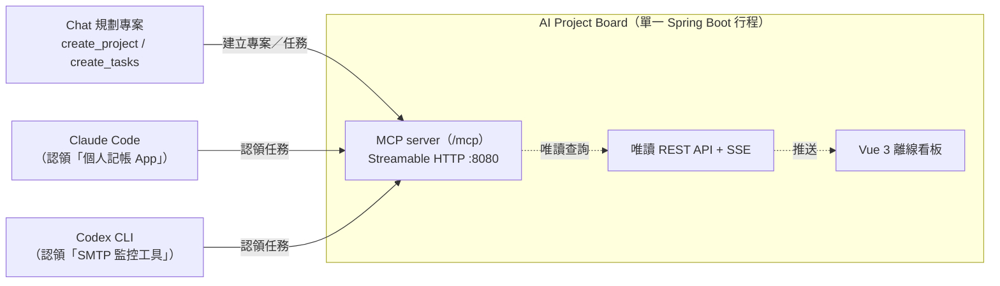

# AI Project Board

> 這是一個**中文專案**：看板介面、錯誤訊息與 MCP 工具說明都是繁體中文。
> English readers: [README.en.md](README.en.md) explains what this is; the UI itself is Chinese.

讓 AI coding agent 一邊工作、一邊把進度寫進看板，你在瀏覽器就能看到所有專案的
狀態，不用盯著好幾個終端機視窗。




在 chat 裡規劃專案、拆成任務卡片；到任一個專案的 repo 裡跟 Claude Code 或 Codex
說「認領 {專案名} 的任務」，就會有角色 agent（backend / frontend / qa / infra /
docs）把前置已完成的工作接走。瀏覽器開著看板即可即時看到狀態，不用重整。

**單機本地執行**，資料放在你自己的電腦上，前端完全離線（Vue 與字型都在 repo 裡），
沒有雲端、沒有帳號、不連外。

---

## 1. 安裝與啟動

### 需要什麼

- **JDK 21**（沒裝的話啟動腳本會偵測並給出對應平台的安裝指令）
- 其他都不用——Maven 用 repo 內附的 `./mvnw`，前端沒有建置步驟

### Windows

```powershell
.\bin\board.ps1 start
```

### macOS / Linux

```bash
./bin/board start
```

第一次啟動會自動組裝 jar（下載依賴 + 編譯，可能要數十秒到數分鐘），之後就很快。
看到 `看板已就緒：http://127.0.0.1:8080` 就可以打開瀏覽器了。

### 日常操作

| 做什麼 | Windows | macOS / Linux |
|---|---|---|
| 啟動 | `.\bin\board.ps1 start` | `bin/board start` |
| 查狀態 | `.\bin\board.ps1 status` | `bin/board status` |
| 停止 | `.\bin\board.ps1 stop` | `bin/board stop` |
| 重啟 | `.\bin\board.ps1 restart` | `bin/board restart` |
| 看日誌 | `.\bin\board.ps1 logs -Lines 200` | `bin/board logs -n 200` |
| 前景啟動（除錯用） | `.\bin\board.ps1 start -Foreground` | — |

**`stop` 逾時後不會自動強制終止**，那會跳過關閉前的一致性備份。確定要強制終止
才加 `--force`（Windows：`-Force`）。

> **Windows 的一個限制**：Windows 沒有 SIGTERM，而 `Stop-Process` 等同 `kill -9`
> （會跳過關閉前備份），因此 `stop` 改用 console control event（`CTRL_C_EVENT`）。
> 若看板是你自己在某個終端機視窗手動 `java -jar` 啟動的，它與那個視窗共用
> console，送 Ctrl+C 會連視窗一起打斷；`stop` 會偵測到並要求你直接到該視窗按
> Ctrl+C（效果相同）。改用 `.\bin\board.ps1 start` 啟動後看板有自己的 console，
> `stop` 即可正常運作。

第一次打開看板是空的（顯示三步驟引導）——這是正常的。**新增專案與任務只能透過
MCP 工具寫入，REST 端點是唯讀的，不會有種子資料。**

---

## 2. 接上你的 AI agent

### Claude Code（建議用 plugin）

一次接好 MCP 端點、六個角色 agent 薄殼與 `claim-tasks` skill：

```bash
claude plugin marketplace add /path/to/AIProjectDashboard
```

```bash
claude plugin install ai-project-board@ai-board
```

第一行註冊 marketplace，第二行才真的安裝。裝完在當前 session 生效需要
`/reload-plugins`，或重開 Claude Code。

安裝後 plugin 的 `board` connector 需要按一次 **Install** 才會註冊到你的環境
（plugin 只是宣告需要這個 MCP server，宣告不等於啟用）。它連的是本機
`127.0.0.1:8080`，所以只在 Claude Code session 內生效，網頁端會顯示
「Connects in sessions」。

> **Windows 使用者請注意**：plugin **不內含編譯好的 jar**，也**不負責啟停看板**。
> 看板要由你自己先用 `.\bin\board.ps1 start` 啟動好，plugin 才連得上。
> plugin 目錄裡不再放任何 `.sh` 腳本——先前那支 `plugin/bin/start-board.sh` 是
> git symlink，而 Windows 的 `core.symlinks` 預設為 `false`，checkout 出來是個
> 24 位元組的文字檔，每個 Windows 使用者拿到的都是壞檔案且沒有任何錯誤訊息。
> 已移除，啟停一律走 `bin\board.ps1`（Windows）或 `bin/board`（mac／Linux）。

之後更新本機來源可執行 `claude plugin update ai-project-board@ai-board`，並重啟
Claude Code。

### Codex

repo 也包含 Codex plugin：`plugins/ai-project-board/` 放角色薄殼、`claim-tasks`
skill 與 MCP 宣告，`.agents/plugins/marketplace.json` 則是 repo marketplace 入口。
GitHub 版本可用下列指令加入並安裝：

```bash
codex plugin marketplace add hpigu/AIProjectDashboard --ref main
codex plugin add ai-project-board@ai-board
```

發布新版後，先刷新 Git marketplace snapshot，再重新安裝 plugin：

```bash
codex plugin marketplace upgrade ai-board
codex plugin add ai-project-board@ai-board
```

若 `codex plugin marketplace list` 已顯示 `ai-board` 指向本機 clone，請勿直接加入
同名 Git source。等新版推到遠端 `main` 後，先明確確認要切換來源，再執行：

```bash
codex plugin marketplace remove ai-board
codex plugin marketplace add hpigu/AIProjectDashboard --ref main
codex plugin add ai-project-board@ai-board
```

第一行只移除 marketplace source 設定；它不是 `codex plugin remove`，不會主動執行
plugin 解除安裝。切換完成後開新 task，確認載入的是 Git marketplace 的版本。

本機開發時，在 Codex 開啟這個 repo 也能直接看到同一份 marketplace。安裝
**AI Project Board** 時若提示啟用 `board` connector，需再確認一次，讓它連到本機
`http://127.0.0.1:8080/mcp`。安裝或更新後重開 task，讓角色與 skill 清單重新載入。

如果不使用 plugin，仍可用下方 `~/.codex/config.toml` 手動接線；差別是只會得到
MCP 工具，不會自動取得 `plugins/ai-project-board/agents/` 的角色薄殼與 leader
skill。完整安裝方式與檔案對照見 [docs/installation.md](docs/installation.md)。

差別是只會得到 MCP 工具，不會自動取得角色薄殼與 leader skill。

Claude Code：

```bash
claude mcp add --transport http board http://127.0.0.1:8080/mcp --scope project
```

Codex（`~/.codex/config.toml`）：

```toml
[mcp_servers.board]
url = "http://127.0.0.1:8080/mcp"
```

完整安裝方式與檔案對照見 [docs/installation.md](docs/installation.md)。

---

## 3. 第一次使用

1. 依上一節把看板接進 Claude Code 或 Codex。
2. 在 chat 裡請 agent 呼叫 `create_project` 建一個專案，再用 `create_tasks`
   拆幾張任務卡片。
3. 回到瀏覽器，應該會即時（透過 SSE）看到剛建立的專案與任務卡片，不用重整。
4. 到該專案的 repo 裡跟 Claude Code / Codex 說「認領 {專案名} 的任務」，
   對應角色的 agent 會呼叫 `claim_next_task` 認領一筆並開工。

---

## 4. Agent 能做什麼

寫入一律走 MCP 工具，REST 端點全部唯讀。常用的幾個：

| 工具 | 用途 |
|---|---|
| `create_project(name, description?)` | 建立專案（同名不分大小寫判重） |
| `create_tasks(projectId, tasks[])` | 一次寫入 1–50 筆任務，可指定前置相依 |
| `list_tasks(...)` | 查詢任務清單與進度 |
| `claim_next_task(projectName, category, assignee)` | 原子認領一筆前置皆已完成的待辦任務 |
| `complete_task(taskId, summary, verificationResults, ...)` | 以摘要與驗證證據完成任務 |
| `block_task(taskId, reasonType, detail, ...)` | 以結構化原因標記 BLOCKED |
| `get_role(name, projectName?)` | 取得角色的完整工作指引 |

**完整的 16 個工具、參數、狀態機規則、REST 端點與治理規則：
[docs/mcp-tools.md](docs/mcp-tools.md)。**

`category` 有 `BACKEND` / `FRONTEND` / `TEST` / `INFRA` / `DOC` / `OTHER` 六種；
填錯或沒填會正規化為 `OTHER`，不會產生無法認領的任務。

任務可以指定前置相依，`claim_next_task` **只發放前置全部完成的任務**，被卡住的
會跳過讓其他任務先做，看板卡片上以「等待 #n」標示。

---

## 5. 看板畫面

- **專案列表**：依名稱前綴搜尋、依狀態（`ACTIVE`／封存）與是否含 `BLOCKED`
  任務篩選、依最近更新／名稱／完成比例排序。篩選條件會同步進 URL，重新整理或
  分享連結可還原。
- **專案看板**：預設 Kanban（依 `category` 分欄），可切換為**相依圖視圖**
  （`?view=dependencies`）。兩種視圖都支援依關鍵字、`category`、`assignee`、
  是否等待前置、是否可認領篩選。
- **任務詳情側欄**：點卡片開啟，顯示完整歷史時間軸，區分一般狀態變更、結構化
  `BLOCKED` 原因（`BLOCKER` 標籤）與完成證據（`EVIDENCE` 標籤）。側欄狀態會反映
  在瀏覽器 history，上一頁與分享連結都能直接開到該任務。
- **BLOCKED 桌面通知**：標題列的開關，預設關閉。任務轉 BLOCKED 時發系統通知，
  點擊跳到該專案；看板視窗在前景時不發（畫面上已經看得到）。
- SSE 驅動即時更新，連線狀態顯示在頁首。

---

## 6. 角色 agent

五個會認領任務的角色，其**完整工作指引存在看板的資料庫裡**（`role` 表），透過
`get_role` 取得，不是寫死在檔案裡。Claude Code / Codex 端只需要一份**薄殼**——
薄殼提供工具白名單與硬邊界，指引由看板提供，兩者職責不同。

判準只有一條：**載入 agent 那一刻就需要的，只能放檔案；開工當下才需要的，放看板。**

完整說明（六個角色、兩階段派工流程、兩層指引來源、手動建立薄殼的範例）：
**[docs/agent-roles.md](docs/agent-roles.md)**

---

## 7. 設定

所有設定都走環境變數，不需要改檔案。

### 常用

```bash
# 換埠號與資料庫位置（mac／Linux）
BOARD_PORT=18080 BOARD_DB_URL='jdbc:h2:file:./data/dev;DB_CLOSE_ON_EXIT=FALSE' bin/board start
```

```powershell
# Windows
$env:BOARD_PORT='18080'; .\bin\board.ps1 start
```

### 完整清單

| 變數 | 預設值 | 說明 |
|---|---|---|
| `BOARD_HOST` | `127.0.0.1` | 監聽位址。改成非 loopback 前請先讀下方「安全性」 |
| `BOARD_PORT` | `8080` | 服務埠號 |
| `BOARD_ALLOWED_HOSTS` | 空 | 額外放行的 `Host`／`Origin`（逗號分隔），DNS rebinding 防護的逃生門 |
| `BOARD_DB_URL` | `jdbc:h2:file:<db-dir>/board;DB_CLOSE_ON_EXIT=FALSE` | H2 資料庫位置 |
| `BOARD_DB_USER` / `BOARD_DB_PASSWORD` | `sa` / 空 | 資料庫帳密 |
| `BOARD_HOME_DIR` | `~/.ai-project-board` | 資料、備份與 PID 檔的家目錄 |
| `BOARD_LOG_FILE` | `<repo>/logs/board.log` | 日誌檔路徑 |
| `BOARD_LOG_MAX_FILE_SIZE` | `10MB` | 單檔達此大小即輪替 |
| `BOARD_LOG_MAX_HISTORY` | `30` | 輪替檔保留天數 |
| `BOARD_LOG_TOTAL_SIZE_CAP` | `250MB` | 所有輪替檔加總上限，超過刪最舊的 |
| `BOARD_BACKUP_DIR` | `~/.ai-project-board/backups` | 三種備份共用的輸出目錄 |
| `BOARD_BACKUP_RETENTION_DAYS` | `30` | 保留天數 |
| `BOARD_BACKUP_RETENTION_MIN_COUNT` | `7` | 每個階段至少保留的份數 |
| `BOARD_BACKUP_SCHEDULE_ENABLED` | `true` | 是否啟用執行中的排程備份 |
| `BOARD_BACKUP_INTERVAL` | `6h` | 排程備份間隔（支援 `6h`、`90m`、`PT6H`） |
| `BOARD_SSE_MAX_CONNECTIONS` | `32` | `/api/events` 連線上限，超過回 `503` |
| `BOARD_SSE_CLIENT_QUEUE_CAPACITY` | `128` | 每連線事件佇列，滿了結束該連線 |
| `BOARD_JAR` | 自動尋找 | 指定要啟動的 jar |
| `BOARD_PID_FILE` | `<BOARD_HOME_DIR>/board.pid` | PID 檔 |
| `BOARD_START_TIMEOUT_SEC` | `60` | `start` 等待就緒秒數 |
| `BOARD_STOP_TIMEOUT_SEC` | `60` | `stop` 等待關閉秒數 |

資料目錄的預設策略：`<repo>/data/board.mv.db` 已存在就沿用（既有使用者向下相容），
否則用 `~/.ai-project-board/data`（避免資料放在可能被 plugin 更新覆蓋的目錄下）。

### 手動啟動

不透過腳本時不包含 JDK／埠號／鎖檔檢查，也不會套用腳本的絕對資料庫路徑策略：

```bash
BOARD_PORT=8081 BOARD_DB_URL='jdbc:h2:file:./data/dev-local' ./mvnw clean package
java -jar target/ai-project-board-backend-3.1.1.jar
```

跑測試：

```bash
BOARD_PORT=8081 BOARD_DB_URL='jdbc:h2:file:./data/dev-local' ./mvnw test
```

---

## 8. 備份與還原

有**三個**備份時機，都共用同一個目錄與保留策略：

| 時機 | 怎麼做 | 檔名 |
|---|---|---|
| **啟動前** | `bin/board start` 在確認資料庫未被鎖住後做檔案複製備份，再跑 Flyway migration。**備份失敗會直接中止啟動** | `board-startup-*.mv.db` |
| **正常關閉前** | `ShutdownBackupService` 監聽 `ContextClosedEvent`（涵蓋 SIGTERM、Ctrl+C、正常 JVM shutdown），用 H2 的 `BACKUP TO` 產生一致性快照。失敗只記 ERROR，**不阻塞關閉** | `board-shutdown-*.zip` |
| **執行中定期** | `ScheduledBackupService` 每 6 小時一份一致性快照。看板連續跑好幾天正是它的預期用法，只靠啟停備份等於好幾天沒有新快照 | `board-scheduled-*.zip` |

三種都走「寫到 `.tmp` → 驗證 → 原子改名」的流程，半成品不會被誤認為可用備份。

**保留策略依階段分桶**：`startup`／`shutdown`／`scheduled` 各自有獨立的份數額度。
共用一個桶的話，每 6 小時一次的排程備份一週內就會把關閉前那份最值得留的快照擠掉。
規則是保留 30 天內的所有備份；超過 30 天的只在刪除後該桶仍 ≥ 7 份時才刪。

**`kill -9` 的限制**：SIGKILL 不給行程任何機會執行 shutdown hook，行程崩潰或斷電
也一樣，只能仰賴啟動前備份與排程備份。

**還原**：

```bash
bin/restore-db.sh --list      # 列出三種備份（新到舊）
bin/restore-db.sh latest      # 還原最新一份
```

```powershell
.\bin\restore-db.ps1 -List
.\bin\restore-db.ps1 latest
```

還原會先確認看板未在執行、資料庫檔未被持有，把現有資料庫**改名保留**成
`board.mv.db.pre-restore-<UTC>`（不刪除），再以 `.tmp` → 驗證 H2 檔頭 → 原子改名
的方式寫入。還錯備份時把保留檔改回原檔名即可。

完整步驟、開機自動啟動與疑難排解見 [docs/operations.md](docs/operations.md)。

---

## 9. 安全性

**目前沒有 server-side 身分驗證。** 設計前提是單機本地執行。

- Codex：安裝本 repo 的 Codex plugin，使用 `plugins/ai-project-board/agents/*.md` 中的
  六個獨立角色薄殼。不使用 plugin 時仍可手動接 MCP，但不建議在
  `~/.codex/AGENTS.md` 再維護一份完整角色規則，以免與看板及 plugin 漂移。

> ⚠️ `/mcp` 一旦綁定到非 loopback 位址（例如 `0.0.0.0`）並對外可達，**任何連得到
> 的人都能呼叫全部 MCP 工具**。除非自行加上反向代理與認證層（Basic Auth／mTLS），
> 否則不要把 `BOARD_HOST` 改成公開位址。

`/api/health` 只回傳最小版本資訊，不含資料庫路徑；需要維運細節時用
`/api/diagnostics`，該端點內容較敏感，呼叫方需自行控管可見範圍。

回報安全問題見 [SECURITY.md](SECURITY.md)。

---

## 10. 已知限制

- 單機使用，看板與資料庫都在本機，**無跨裝置同步**；未提供或驗證任何雲端伺服器
  部署方式，只支援本地啟動。
- `/mcp` **沒有 server-side 身分驗證**（見上一節）。
- SSE 連線集合是行程內單例，**不支援多副本水平擴展**。
- **角色指引不跟著 plugin 走**：指引存在 H2 資料庫，plugin 只散布程式碼與薄殼。
  新裝的看板會由 `RoleSeeder` 建立初始指引，但你自己用 `upsert_role` 調整過的
  內容不會跟著 plugin 帶走，換機器或重建資料庫要重新灌一次。
- 介面與訊息都是繁體中文，**沒有 i18n**。

---

## 目錄結構

```
src/main/java/dev/aiboard/
├── mcp/        # MCP 工具定義（ProjectBoardTools、TaskBlockTools、TaskCompleteTools 等）
├── task/       # 任務 Entity / Repository / Service（複雜度大半在這）
├── project/    # 專案 Entity / Repository / Service
├── role/       # 角色 Entity / Repository / Service（含 RoleSeeder）
├── health/     # HealthService／LivenessService／ReadinessService／DiagnosticsService
├── web/        # 唯讀 REST Controller 與 SseEmitterRegistry
├── event/      # SSE 事件發布
├── config/     # MCP tool 註冊、三種備份服務、Host/Origin 與安全標頭 filter
└── common/     # 共用例外與列舉（TaskCategory 等）

src/main/resources/
├── application.yml
├── db/migration/   # Flyway migration
└── static/         # 零建置 Vue 3 前端（index.html / app.js / tokens.css），
                     # Vue 執行檔與字型皆 vendor 進 static/vendor/，完全離線可用，
                     # 不需連外部 CDN，見 static/vendor/SOURCES.md
bin/
├── start-board.sh  # 啟動腳本（JDK 偵測、埠號檢查、H2 鎖檔偵測、啟動前備份、自動組裝）
└── backup-db.sh    # 啟動前冷備份與保留策略，由 start-board.sh 呼叫
plugin/             # Claude Code plugin 骨架（agents/ 薄殼、claim-tasks skill、.mcp.json）
plugins/
└── ai-project-board/   # Codex plugin（manifest、agents、skill、.mcp.json）
.claude-plugin/
└── marketplace.json    # Claude Code 的安裝入口，指向 plugin/
.agents/plugins/
└── marketplace.json    # Codex repo/Git marketplace，指向 plugins/ai-project-board/
docs/
├── installation.md            # 完整安裝指南
├── dev-isolation.md           # 開發環境隔離基線（埠號／資料庫／日誌／worktree 對照）
└── scope-leader-dispatch.md   # Leader 派工架構、Git 邊界與角色責任分工
```

## 技術棧

Spring Boot 3.5.16、Spring AI 1.1.8（MCP server，Streamable HTTP）、Java 21、H2、
Flyway、Vue 3（零建置，執行檔與字型皆 vendor 進 repo，前端完全離線可用）。

## 更多文件

| 文件 | 內容 |
|---|---|
| [docs/mcp-tools.md](docs/mcp-tools.md) | 完整 MCP 工具與 REST 端點參考、狀態機、完成證據、治理規則 |
| [docs/agent-roles.md](docs/agent-roles.md) | 六個角色、兩階段派工流程、薄殼與看板指引的兩層來源 |
| [docs/installation.md](docs/installation.md) | 完整安裝指南、資料目錄規劃、plugin 疑難排解 |
| [docs/release-install-update-sop.md](docs/release-install-update-sop.md) | Claude／Codex 共用的 GitHub 發布、安裝與更新 SOP：marketplace 加入/更新、plugin 安裝、server 首次安裝、`board update`、版本相容矩陣、本機轉 Git marketplace 的影響與回退 |
| [docs/release-contract.md](docs/release-contract.md) | Release asset 契約：檔名、SHA-256 清單格式、四平台 CI 流程 |
| [docs/operations.md](docs/operations.md) | 維運手冊：啟停、備份還原演練、開機自動啟動、疑難排解 |
| [docs/roadmap.md](docs/roadmap.md) | 產品化清單與決策紀錄（想知道「為什麼是這樣」看這份） |
| [AGENTS.md](AGENTS.md) | 給 AI agent 的開發規則（架構限制、開發用埠號與資料庫隔離） |
| [CHANGELOG.md](CHANGELOG.md) | 使用者可見的變更紀錄 |
