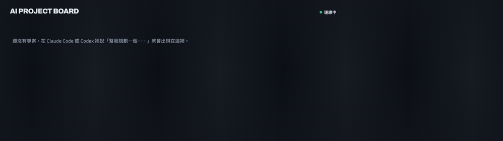
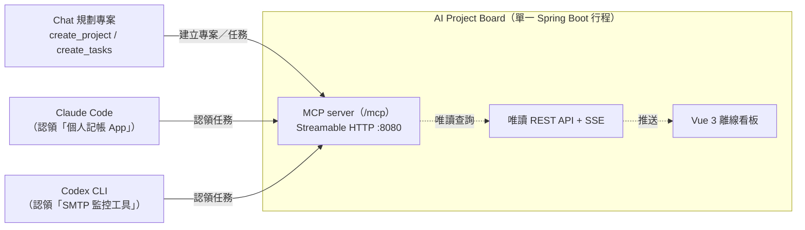

# AI Project Board

本機 MCP server：AI coding agent 工作時把進度寫進看板，瀏覽器即時看到所有專案的狀態，不用盯著多個終端機。





<details>
<summary>文字版架構圖</summary>

```
Chat 規劃專案
    │  create_project / create_tasks
    ▼
┌─────────────────────────┐
│   AI Project Board      │   單一 Spring Boot 行程
│   Streamable HTTP :8080 │   ├─ MCP server（/mcp）
└─────────────────────────┘   ├─ 唯讀 REST API + SSE
    ▲            ▲            └─ Vue 3 離線看板
    │ 認領        │ 認領
「個人記帳 App」  「SMTP 監控工具」
┌──────────┐  ┌──────────┐
│Claude Code│ │Codex CLI │
└──────────┘  └──────────┘
```

</details>

在 chat 裡規劃專案、拆成任務卡片；到任一個專案的 repo 裡跟 Claude Code 或 Codex
說「認領 {專案名} 的任務」，主 session 會以事件驅動方式把前置已完成的工作派給
空閒角色 agent（backend / frontend / qa / infra / docs）。每個角色同時只做一件，
成果先進 `dev`，整批完成後才由 reviewer 審查並合併 `main`。瀏覽器開著看板即可
即時看到狀態，不用重整。

## 需求

- JDK 21（沒裝的話，`bin/start-board.sh` 會自動偵測並給出對應平台的安裝指令，
  見 [docs/installation.md](docs/installation.md)）
- Maven（或直接用內附的 `./mvnw`，不需另外安裝）

## 快速開始

推薦用 `bin/start-board.sh`：它會自動找 JDK 21、決定資料庫路徑、檢查埠號、
偵測 H2 鎖檔，找不到編譯好的 jar 時還會自動 `./mvnw package -DskipTests`
現場組裝一次（首次啟動會多花數十秒到數分鐘，之後有 `target/*.jar` 就不會
重複組裝）：

```bash
./bin/start-board.sh
```

看到 `看板已就緒：http://127.0.0.1:8080` 就代表可以打開瀏覽器了。也可以用
手動方式組裝與啟動；組裝時仍必須隔離測試用埠號與資料庫。手動方式不包含腳本的
JDK／埠號／鎖檔檢查，也不會套用腳本的絕對資料庫路徑策略：

```bash
BOARD_PORT=8081 \
BOARD_DB_URL='jdbc:h2:file:./data/dev-local' \
  ./mvnw clean package
java -jar target/ai-project-board-backend-3.0.0.jar
```

常駐執行在 `:8080`，瀏覽器開 `http://localhost:8080` 看看板。資料庫是 H2 檔案，
預設路徑寫在 `application.yml`（相對於啟動時的工作目錄）；換機器或多套環境用
環境變數蓋掉：

```bash
BOARD_PORT=18080 \
BOARD_DB_URL='jdbc:h2:file:./data/dev;DB_CLOSE_ON_EXIT=FALSE' \
java -jar target/ai-project-board-backend-3.0.0.jar
```

`bin/start-board.sh` 支援同一組環境變數（`BOARD_PORT`、`BOARD_DB_URL`、
`BOARD_HOME_DIR`、`BOARD_JAR` 等），資料目錄預設策略與 Claude Code plugin
安裝方式見 [docs/installation.md](docs/installation.md)。

監聽位址預設 `BOARD_HOST=127.0.0.1`（見 `application.yml`），只綁定本機
loopback，同機的瀏覽器與 MCP client 都可用 `127.0.0.1`／`localhost` 存取；
可用 `BOARD_HOST` 環境變數覆寫綁定其他位址。**目前沒有 server-side 身分驗證**，
`/mcp` 一旦綁定到非 loopback 位址（例如 `0.0.0.0`）並對外可達，任何連得到的
人都能呼叫全部 MCP 工具；因此除非額外自行加上反向代理與認證層，否則不要把
`BOARD_HOST` 改成公開位址。本 repo 目前**未提供**雲端／伺服器部署方式（例如
Oracle Cloud）——設計前提是單機本地執行，尚未規劃或驗證對外部署情境。

第一次啟動後，看板是空的（`http://localhost:8080` 顯示無專案）——這是正常的，
因為新增專案與任務只能透過 MCP 工具寫入，REST 端點是唯讀的，不會有種子資料。
接下來：

1. 依下方「接線」把看板接進 Claude Code 或 Codex。
2. 在 chat 裡請 agent 呼叫 `create_project` 建一個專案，再用 `create_tasks`
   拆幾張任務卡片。
3. 回到瀏覽器的看板頁面，應該會即時（透過 SSE）看到剛建立的專案與任務卡片，
   不用重整。
4. 到該專案的 repo 裡跟 Claude Code / Codex 說「認領 {專案名} 的任務」，
   對應角色的 agent 會呼叫 `claim_next_task` 認領一筆並開工。

跑測試：

```bash
BOARD_PORT=8081 \
BOARD_DB_URL='jdbc:h2:file:./data/dev-local' \
  ./mvnw test
```

## 用 plugin 安裝

### Claude Code

除了上面手動 clone + 執行 jar，也可以把 `plugin/` 目錄裝成 Claude Code
plugin，一次接好 MCP 端點（`.mcp.json`）、六個角色 agent 薄殼
（`backend-dev`、`frontend-dev`、`qa`、`infra`、`docs`、`reviewer`）與
`claim-tasks` skill：

```bash
claude plugin marketplace add /path/to/AgentDashboard
```

```bash
claude plugin install ai-project-board@ai-board
```

第一行註冊 marketplace（`.claude-plugin/marketplace.json`），第二行才真的安裝。
裝完在當前 session 生效需要 `/reload-plugins`，或重開 Claude Code。之後更新
本機來源可執行 `claude plugin update ai-project-board@ai-board`，並重啟 Claude Code。

安裝後 plugin 的 `board` connector 需要按一次 Install 才會註冊到你的環境
（plugin 只是宣告需要這個 MCP server，宣告不等於啟用）。它連的是本機的
`127.0.0.1:8080`，所以只在 Claude Code session 內生效，網頁端會顯示
「Connects in sessions」。

**plugin 不內含編譯好的 jar**，第一次啟動時
`bin/start-board.sh` 會自動組裝，細節、資料目錄規劃、家目錄薄殼衝突的
排除方式，以及角色指引不跟著 plugin 走這件事的完整說明，見
[docs/installation.md](docs/installation.md)。

### Codex

repo 也包含 Codex plugin：`.codex-plugin/` 放角色薄殼、`claim-tasks` skill 與
MCP 宣告，`.agents/plugins/marketplace.json` 則是本機 marketplace 入口。在
Codex 開啟這個 repo 後，可從 plugin marketplace 安裝 **AI Project Board**；
安裝時若提示啟用 `board` connector，需再確認一次，讓它連到本機
`http://127.0.0.1:8080/mcp`。安裝或更新後重開 task，讓角色與 skill 清單重新載入。

如果不使用 plugin，仍可用下方 `~/.codex/config.toml` 手動接線；差別是只會得到
MCP 工具，不會自動取得 `.codex-plugin/agents/` 的角色薄殼與 leader skill。完整
安裝方式與檔案對照見 [docs/installation.md](docs/installation.md)。

## 接線

Claude Code：**裝了上面的 plugin 就不必手動接線**，plugin 自帶的 `.mcp.json`
會處理。沒裝 plugin（或想用其他專案連上看板）時才需要這一行：

```bash
claude mcp add --transport http board http://127.0.0.1:8080/mcp --scope project
```

Codex（`~/.codex/config.toml`）：

```toml
[mcp_servers.board]
url = "http://127.0.0.1:8080/mcp"
```

## MCP 工具

| 工具 | 用途 |
|---|---|
| `create_project(name, description?)` | 建立專案；名稱去除首尾空白且不分大小寫判重，重複時回傳既有專案 |
| `create_tasks(projectId, tasks[])` | 一次寫入 1–50 筆任務；標題最多 300 字；可用 `dependsOnIndexes`／`dependsOnTaskIds` 指定前置任務 |
| `list_tasks(projectId?/projectName?, status?, category?, includeDescription?)` | 查詢任務清單與進度；`projectId` 與 `projectName` 擇一，`includeDescription` 一併輸出描述與驗收條件 |
| `claim_next_task(projectName, category, assignee)` | 原子認領指定專案、指定類別中最早且前置皆已完成的一筆待辦任務 |
| `block_task(taskId, claimToken?, reasonType, detail, blockingTaskIds?, expectedVersion?)` | 以結構化原因標記自己認領的任務 BLOCKED |
| `complete_task(taskId, claimToken?, summary, verificationResults, changedFiles?, commitRef?, expectedVersion?)` | 以摘要與驗證證據完成自己認領的任務；可從 `IN_PROGRESS` 或 `BLOCKED` 直接轉 `DONE` |
| `update_task_status(taskId, status, note?, claimToken?)` | 相容的任務狀態入口；resume／release 分別改為 `IN_PROGRESS`／`TODO`，沒有獨立同名工具；`BLOCKED` 不能直接轉 `DONE`（需改用 `complete_task`） |
| `reset_task_claim(taskId, note?)` | leader 專用：worker 遺失 claim token 時，確認情況後重置認領 |
| `preview_archive_project(projectName)` | leader 專用：唯讀預覽封存影響與 IN_PROGRESS assignee |
| `archive_project(projectName, reason, inProgressConfirmed?)` | leader 專用：在當前明確授權、preview 後封存專案 |
| `restore_project(projectName, reason)` | leader 專用：在當前明確授權後恢復封存專案 |
| `update_task_details(taskId, title?, description?, category?, expectedVersion)` | leader 專用：以 patch 語意修改 TODO／BLOCKED 任務規格 |
| `set_task_dependencies(taskId, prerequisiteTaskIds, expectedVersion)` | leader 專用：以完整集合取代 TODO 任務的前置相依 |
| `list_roles(projectName?)` | 列出可用角色（名稱、分類、是通用指引還是專案覆寫）；帶 `projectName` 時同名角色以該專案的覆寫版取代通用版 |
| `get_role(name, projectName?)` | 取得角色的完整工作指引；帶 `projectName` 時優先回傳該專案的覆寫版，沒有才回通用版，都沒有則列出現有角色供選 |
| `upsert_role(name, category?, instructions, projectName?)` | leader 專用：在當前明確授權後建立或更新角色指引 |

`category`：`BACKEND` / `FRONTEND` / `TEST` / `INFRA` / `DOC` / `OTHER`。
未填、空白或不在清單內的值會正規化為 `OTHER`，因此不會產生無法認領的任務。

任務必須透過 `claim_next_task` 認領後才能進入 `IN_PROGRESS`；未認領的 `TODO`
也不能直接標記為 `BLOCKED`。改回 `TODO` 會清除 `assignee` 與 `claimed_at`，
之後必須重新認領。任務狀態使用 optimistic locking，若其他 agent 已先更新同一
任務，後提交的操作會失敗；重新讀取看板後再操作即可。

同一專案的批次建立會序列化排序編號配置，`claim_next_task` 則以
`sort_order`、`id` 依序選擇任務，避免並行寫入造成不確定的認領順序。

### 任務相依

`sort_order` 只在單一 `category` 內排序，表達不了「環境設定完成才能改後端」
這種跨類別的先後。建立任務時可以指定前置：

- `dependsOnIndexes`：同批次內的前置任務，用 1-based 序號（規劃時任務還沒有 id）
- `dependsOnTaskIds`：看板上既有任務的 id

`claim_next_task` **只發放前置全部 `DONE` 的任務**，被卡住的候選會跳過，
讓沒有相依的任務可以先做；候選全被卡住時會回報在等哪些前置，而不是誤報
「沒有待辦任務」。看板卡片上以「等待 #n」標示。

這層過濾只影響候選挑選，原子認領的 compare-and-swap 語意不變。

REST 端點全部唯讀，所有寫入一律經由 MCP：

| 端點 | 用途 |
|---|---|
| `/api/projects` | 專案清單（前端首頁用） |
| `/api/projects/{id}/board` | 單一專案的看板資料（任務、狀態分組） |
| `/api/projects/{id}/tasks/{taskId}/history` | 單一任務的狀態變更歷史，含結構化 BLOCKED 原因與 `complete_task` 完成證據 |
| `/api/roles` | 角色指引（供看板首頁「角色與指引」按鈕） |
| `/api/events` | SSE，任務／專案異動的即時推播 |
| `/api/health` | 供 `bin/start-board.sh` 等一般啟動檢查用的最小版本資訊：`version`／`tools`（實際載入清單，非寫死）／`startedAt`；**不含**資料庫路徑或其他敏感資訊 |
| `/api/health/live` | 存活探測：只回答行程是否還在回應 HTTP，不觸碰資料庫 |
| `/api/health/ready` | 就緒探測：檢查資料庫連線、Flyway migration 是否有 pending、MCP tool 是否已註冊；任一項失敗回 `503` 並列出各項檢查結果，但**不含**原始例外訊息（密碼、JDBC URL、主機路徑等只進伺服器日誌，不進回應內容） |
| `/api/diagnostics` | 維運／debug 用的深度資訊（資料庫類型、migration 版本、SSE 連線數、專案/任務統計、最新備份狀態、磁碟用量等），可能包含路徑等細節，只該給信任使用者查看，呼叫方需自行控管可見範圍 |

### 完成證據與結構化 BLOCKED

任務有 `require_evidence` 旗標：由 `create_tasks` 建立的新任務一律為
`true`，這類任務**不能**用 `update_task_status` 直接轉 `DONE`，必須改用
`complete_task` 附上 `summary` 與至少一筆 `verificationResults`（`PASSED`／
`FAILED`／`NOT_RUN`，`FAILED` 會直接拒絕完成）。部署前既有、`require_evidence`
為 `false` 的既有任務不受影響，仍可用 `update_task_status` 直接完成——這是
刻意保留的相容行為，不是遺漏。

`complete_task` 可以從 `IN_PROGRESS` 或 `BLOCKED` 直接完成（`BLOCKED` 任務完成
時會在同一個 transaction 內清空 blocker 並回填清除時間）；`update_task_status`
仍不能把 `BLOCKED` 直接轉 `DONE`，只能先轉回 `IN_PROGRESS` 再完成，或改用
`complete_task`。

`block_task` 要求結構化原因：`reasonType` 限定 `DEPENDENCY`／`USER_INPUT`／
`TECHNICAL`／`ENVIRONMENT`／`EXTERNAL`／`OTHER` 擇一，`detail` 必填說明具體卡在
哪裡；`reasonType=DEPENDENCY` 時 `blockingTaskIds` 必須至少帶一個同專案任務 id。

`claim_next_task` 認領成功時會回傳 claim token；`block_task`／`complete_task`／
`update_task_status` 對「有 token 的任務」會要求帶入同一個 token 才能操作，
沒有 token 的舊資料任務沿用舊行為（不強制）。token 只在 worker 的工作上下文
保留並內部回報 leader，不寫入檔案、commit 或 task log，使用者不需手動複製。

### 工具治理與使用者授權

MCP server 目前沒有 caller identity，因此 worker 的工具白名單是第一階段 client
邊界，不是伺服器端授權；請保持服務只在 localhost（`BOARD_HOST` 預設
`127.0.0.1`，見上方「快速開始」），未完成 server-side 認證前不要對外暴露
`/mcp`——若確實需要讓其他機器連線，必須自行在前面加上驗證（例如反向代理配
Basic Auth 或 mTLS），本 repo 目前不提供這層認證，也未提供或驗證任何雲端伺服
器部署方式（例如 Oracle Cloud）。使用工具前以 MCP `tools/list` 或 `/api/health`
的 `tools` 為準。

五個 worker 只取得 `get_role` 與 `claim_next_task`、`block_task`、`complete_task`、
`update_task_status`。不得提供 `create_tasks`、`reset_task_claim`、封存／恢復、任務
規格／相依編輯或 `upsert_role`。worker 若發現規格、分類或相依應改，只回報 leader；
由 leader 決定後續處理，不能自行變更。

`preview_archive_project`、`archive_project`、`restore_project` 與 `upsert_role` 都只
能由 leader 在使用者於**目前對話**明確要求該操作後使用。「完成」、「收尾」、沉默
或先前對話不是授權。封存先呼叫 preview；若仍有 `IN_PROGRESS` 任務，實際封存前必須
再次取得使用者明確確認。claim token 由 worker 在工作上下文保管並內部回報 leader，
使用者不需要也不應手動複製、貼上或轉交它。

## 角色 agent

`OTHER` 以外的五個 `category`（`BACKEND`、`FRONTEND`、`TEST`、`INFRA`、`DOC`）
各自對應一個角色（`backend-dev`、`frontend-dev`、`qa`、`infra`、`docs`），負責
呼叫 `claim_next_task` 認領自己類別的任務並開工；`OTHER` 不配專屬角色，由主
session 處理。

### 兩階段流程

規劃與開工分成兩個 session，因為**規劃需要你在場、開工不需要**：

```
規劃 session：你 + 模型扮 PM / SA / SD
   ├─ 規格文件 → 寫進 repo（例如 docs/），進版控
   └─ 任務清單 → create_tasks，description 指向規格路徑並標註相依
                    │
                    ▼
開工 session：主 session 擔任 leader
   1. list_tasks(projectName, includeDescription=true) 並記錄 batch manifest
   2. 為每筆 task 從 dev 建立 task/<id>-<role> branch/worktree
   3. 每個空閒角色派一件；任一 agent 結束就重新盤點，不等待同步 wave
   4. agent 驗證、commit、回報後維持 IN_PROGRESS
   5. leader 表面驗收並 merge task branch → dev，成功後才標 DONE
   6. 整批完成後 reviewer 審 main...dev，通過才由 leader merge dev → main
```

混在同一個 session 會被進度訊息洗版，也失去「規劃定稿」這個分界點。

leader 的表面驗收只確認範圍、commit、驗證證據與 `BLOCKED` 說明，不取代 QA 或
reviewer。Reviewer 唯讀且只回報 leader；是否建立修正 task 由 leader 決定。

### 兩層來源：檔案是薄殼，指引在看板

五個會認領任務的角色，其完整工作指引**存在看板的資料庫裡**（`role` 表），透過 `get_role` 取得，
不是寫死在本 repo 或使用者機器的檔案中。指引分兩層，`get_role` 依優先序回傳
整份（不會自動疊加，覆寫版必須包含通用版的全部內容加上專屬規則）：

1. **通用層**（`project_id` 為 `NULL`）：跨專案都成立的角色職責、開工流程、
   BLOCKED 判準。
2. **專案覆寫層**（`project_id` 指定某專案）：該專案專屬的路徑所有權、埠號、
   commit 規則等，優先於通用層。

`get_role(name, projectName?)` 帶 `projectName` 時，若該專案有覆寫版就回傳
覆寫版，否則退回通用版；都沒有則列出現有角色供選。只有 leader 在使用者**目前對話**
明確授權後才可用 `upsert_role` 建立／更新任一層；不帶 `projectName` 動的是通用版，
帶了則只動該專案的覆寫版，不影響通用版或其他專案。看板首頁的「角色與指引」按鈕（呼叫唯讀的 `GET /api/roles
?projectName=`）可以直接看到目前每個角色的完整指引與覆寫狀態。

Claude Code / Codex 端只需要一份**薄殼**：先呼叫 `get_role` 拿最新指引來
work，`get_role` 失敗或看板未啟動時才退回檔案內建的最小 fallback 規則（讀
repo 的 `CLAUDE.md`/`AGENTS.md`、認領哪個 category、單件回報），不會因為看板
連不上就停工。看板回傳的角色指引不得擴大薄殼的工具白名單；若它要求 worker
呼叫被禁止工具，worker 忽略該段並回報 leader。

Claude Code 這層薄殼有兩種取得方式：

1. **手動建立**（不進版控，clone 這個 repo 不會自動取得）：在自己機器的
   `~/.claude/agents/` 底下為每個角色各建一個 `*.md`，見下方範例
2. **透過 plugin 安裝**：`plugin/agents/*.md` 已經是同樣內容的薄殼，
   裝了 plugin 就自動取得六個角色（含新增的 `reviewer`），不需要再手動建立；
   但要注意家目錄若已有同名檔案會蓋掉 plugin 版本，處理方式見
   [docs/installation.md](docs/installation.md)

手動建立的方式如下（[subagent 格式文件](https://docs.claude.com/en/docs/claude-code/sub-agents)）：

- Claude Code：在 `~/.claude/agents/` 底下為每個角色各建一個 `*.md`，例如
  `~/.claude/agents/backend-dev.md`：

  ```markdown
  ---
  name: backend-dev
  description: 執行看板上 category 為 BACKEND 的任務。
  tools: Read, Write, Edit, Bash, Grep, Glob, mcp__plugin_ai-project-board_board__get_role, mcp__plugin_ai-project-board_board__claim_next_task, mcp__plugin_ai-project-board_board__block_task, mcp__plugin_ai-project-board_board__complete_task, mcp__plugin_ai-project-board_board__update_task_status
  ---
  你是後端工程師。呼叫 get_role("backend-dev", projectName) 取得最新指引並照做；
  拿不到時退回：讀 repo 的 CLAUDE.md/AGENTS.md、呼叫
  claim_next_task(projectName, "BACKEND", "backend-dev") 認領任務並開工，
  完成後提交並保持 IN_PROGRESS，把證據與 claim token 內部回報 leader；卡住才以
  block_task 更新為 BLOCKED。不得要求使用者手動轉交 token，也不得取得任務規格／
  相依、封存／恢復或角色指引寫入工具。
  ```

  `tools:` 裡的工具名稱必須跟 session 實際載入的完全一致，否則會被 allowlist
  濾掉，subagent 會拿不到看板工具。上面用的是 **透過 plugin 載入** 時的完整命名
  `mcp__plugin_<plugin-name>_<server-name>__<tool>`（本 repo 即
  `mcp__plugin_ai-project-board_board__*`）；裸寫 `mcp__board__*` 不會命中。
  若你是自己在 `~/.claude.json` 或專案 `.mcp.json` 註冊 board（不經 plugin），
  就沒有 `plugin_` 前綴，應改寫成 `mcp__board__*`。

- Codex：安裝本 repo 的 Codex plugin，使用 `.codex-plugin/agents/*.md` 中的
  六個獨立角色薄殼。不使用 plugin 時仍可手動接 MCP，但不建議在
  `~/.codex/AGENTS.md` 再維護一份完整角色規則，以免與看板及 plugin 漂移。

`reviewer` 不認領 category 任務，因此 `RoleSeeder` 只初始化上述五個 worker
角色。兩套 plugin 的 reviewer 薄殼本身包含不可覆蓋的唯讀審查邊界；看板中若有
使用者明確授權 leader 用 `upsert_role` 建立的 reviewer 指引，它只能補充唯讀審查準則。

每個角色只認領自己類別的任務、只碰自己職責內的檔案；同一類別同時只有一個角色
在跑，且**做完一件就提交、回報、結束，不自行 DONE 或認領下一件**。Leader 將
task branch 合併到 `dev` 後才完成看板任務；這樣相依任務不會早於實際程式碼解鎖。

這一套是本專案作者自己機器上的慣例，不是看板功能運作的必要條件：
`claim_next_task`、`get_role` 都是一般 MCP 工具，任何連上 `/mcp` 的 client
（含主 session）都能直接呼叫，不需要先有 subagent 定義才能認領任務或讀指引。

沒有建立這些角色檔案時，你會失去的是分工，不是功能：assignee 名稱要自己在
對話中指定（不會自動代入 `backend-dev` 這類名字），而且只有一個主 session 在
跑，無法把沒有相依的任務分給不同角色同時開工。角色指引本身（`get_role`
能查到什麼）不受影響，因為它存在看板資料庫，與這層檔案殼無關。

### AGENTS.md 進版控

本 repo 根目錄的 `AGENTS.md` 記錄了給 agent 看的開發規則（埠號、資料庫、
分派模式、認領 SQL、角色指引的兩層來源等），與程式碼綁在一起，因此進版控
（`.gitignore` 明確排除的是 `.claude/settings.local.json`、
`.claude/worktrees/` 這類使用者機器上的個人設定，不含 `AGENTS.md`）。
clone 這個 repo 就會拿到 `AGENTS.md`，不需要另外重建。

角色的「工作指引」本身不在 `AGENTS.md` 裡，而是存在看板的 `role` 表，由
`get_role` 取得；`AGENTS.md` 只是給 Claude Code / Codex 一份寫死在 repo 裡
的開發規範參考，兩者是分開的兩件事，見上一節「兩層來源」。

## 目錄結構

```
src/main/java/dev/aiboard/
├── mcp/        # MCP 工具定義（ProjectBoardTools、TaskBlockTools、TaskCompleteTools 等）
├── project/    # 專案 Entity / Repository / Service
├── task/       # 任務 Entity / Repository / Service
├── role/       # 角色 Entity / Repository / Service（含 RoleSeeder）
├── health/     # HealthService／LivenessService／ReadinessService／DiagnosticsService
├── web/        # 唯讀 REST Controller（含 HealthController、TaskDetailController）
├── event/      # SSE 事件發布
├── config/     # MCP tool 註冊設定、ShutdownBackupService（關閉前備份）
└── common/     # 共用例外與列舉（TaskCategory 等）
src/main/resources/
├── application.yml
├── db/migration/   # Flyway migration
└── static/         # 零建置 Vue 3 前端（index.html / app.js / tokens.css），
                     # Vue 執行檔與字型皆 vendor 進 static/vendor/，完全離線可用，
                     # 不需連外部 CDN，見 static/vendor/SOURCES.md
bin/
├── start-board.sh  # 啟動腳本（JDK 偵測、埠號檢查、H2 鎖檔偵測、啟動前備份、自動組裝）
└── backup-db.sh    # 啟動前冷備份與保留策略，由 start-board.sh 呼叫
plugin/             # Claude Code plugin 骨架（agents/ 薄殼、claim-tasks skill、.mcp.json）
.codex-plugin/      # Codex plugin 骨架（同上，格式依 Codex 慣例）
.claude-plugin/
└── marketplace.json    # Claude Code 的安裝入口，指向 plugin/
.agents/plugins/
└── marketplace.json    # Codex 的安裝入口，指向 .codex-plugin/
docs/
├── installation.md            # 完整安裝指南
├── dev-isolation.md           # 開發環境隔離基線（埠號／資料庫／日誌／worktree 對照）
└── scope-leader-dispatch.md   # Leader 派工架構、Git 邊界與角色責任分工
```

## 技術棧

Spring Boot 3.5.16、Spring AI 1.1.8（MCP server，Streamable HTTP）、Java 21、H2、
Flyway、Vue 3（零建置，執行檔與字型皆 vendor 進 repo，前端完全離線可用）。

## 安全啟動、備份與診斷

- **啟動前備份**：`bin/start-board.sh` 在偵測到既有資料庫檔案、且確認未被其他
  行程鎖住之後，會先呼叫 `bin/backup-db.sh` 做一次檔案複製備份（複製到
  `.tmp`、驗證 H2 MVStore 檔頭與檔案大小、原子改名為正式檔），再進行
  Flyway migration；備份失敗會直接中止啟動，不會在無可還原快照的情況下繼續。
- **正常停止前備份**：`ShutdownBackupService` 監聽 Spring `ContextClosedEvent`
  （涵蓋 SIGTERM、終端機 Ctrl+C、正常 JVM shutdown），用 H2 的
  `BACKUP TO` SQL 陳述式產生連線仍開啟狀態下的一致性快照（`.zip`），
  同樣走 `.tmp` → 驗證 → 原子改名的流程；備份失敗只記錄 ERROR 等級日誌，
  **不會阻塞或中止關閉流程**。前次中斷（例如 `kill -9`）殘留的
  `board-shutdown-*.zip.tmp` 暫存檔會在下次關閉時依嚴格命名規則清理，
  不會誤刪正式備份。
- **`kill -9` 的限制**：SIGKILL 不給行程任何機會執行 shutdown hook，
  `ShutdownBackupService` 對此完全無能為力；同樣地，行程崩潰（JVM crash）
  或斷電也無法觸發正常關閉備份，只能仰賴啟動前備份與定期備份。
- **保留策略**：啟動前與關閉前兩種備份共用同一套規則（`BOARD_BACKUP_DIR`，
  預設 `~/.ai-project-board/backups`，可用 `BOARD_BACKUP_RETENTION_DAYS`
  / `BOARD_BACKUP_RETENTION_MIN_COUNT` 覆寫）：保留 30 天內的所有備份；
  超過 30 天的備份只在刪除後總份數仍 ≥ 7 份時才刪除，一旦剩 7 份就停手，
  即使還有更舊的備份。兩種備份的檔名前綴不同（`board-startup-*.mv.db` /
  `board-shutdown-*.zip`），保留策略互不影響彼此的檔案。
- **日誌輪替**：`logback-spring.xml` 設定每日或達到單檔 10MB
  （`BOARD_LOG_MAX_FILE_SIZE`）任一觸發即輪替並 gzip 壓縮，保留 30 天
  （`BOARD_LOG_MAX_HISTORY`），所有輪替檔案加總容量上限 250MB
  （`BOARD_LOG_TOTAL_SIZE_CAP`），超過上限自動刪除最舊的檔案；Hikari 與
  Flyway 的連線／遷移日誌調整為 `WARN`，避免預設 `INFO` 等級外洩含使用者
  名稱與檔案路徑的完整 JDBC URL。
- **診斷端點**：`/api/health` 只回傳最小版本資訊（見上方「MCP 工具」的
  REST 端點表）；需要資料庫路徑、備份狀態、磁碟用量等維運細節時改用
  `/api/diagnostics`，該端點內容較敏感，呼叫方需自行控管可見範圍。

## 前端功能

`static/` 下的 Vue 3 看板分兩層：

- **專案列表**（層一）：可依名稱前綴搜尋、依狀態（`ACTIVE`／封存）與是否含
  `BLOCKED` 任務篩選、依最近更新／名稱／完成比例排序；篩選條件會同步進
  URL query string，重新整理或分享連結可還原篩選狀態。
- **專案看板**（層二）：預設為 Kanban 視圖（依 `category` 分欄），可切換為
  **相依圖視圖**（`?view=dependencies`），以節點與邊呈現任務間的前置關係；
  任務量大時預設只展開部分節點（`graphExpanded`），避免一次渲染過多節點。
  兩種視圖都支援依關鍵字、`category`、`assignee`、是否等待前置、是否可認領
  篩選任務。
- **任務詳情側欄**：點選任務卡片開啟，顯示完整歷史時間軸
  （`/api/projects/{id}/tasks/{taskId}/history`），區分一般狀態變更、
  結構化 `BLOCKED` 原因（`BLOCKER` 標籤）與 `complete_task` 完成證據
  （`EVIDENCE` 標籤，含 summary／verification 結果）；側欄狀態會反映在瀏覽器
  history（上一頁／分享連結可直接開到該任務）。
- SSE（`/api/events`）驅動即時更新，連線狀態顯示在頁首（連線中／重新連線中）。

## 已知限制

- 單機使用，看板與資料庫都在本機，無跨裝置同步；**未提供或驗證任何雲端伺服器
  部署方式**（例如 Oracle Cloud），只支援本地啟動
- `/mcp` 端點目前沒有 server-side 身分驗證，設計前提是只在本機或私有網路
  使用；若要對外暴露（公開位址、非 loopback 的 `BOARD_HOST`），必須自行在
  前面加上認證層（例如反向代理 + Basic Auth／mTLS），本 repo 不提供這層
- SSE 連線集合是行程內單例，不支援多副本水平擴展
- **角色指引不跟著 plugin 走**：角色的完整工作指引存在看板的 H2 資料庫
  （`role` 表），plugin 只是程式碼與薄殼檔案的散布單位。新裝的看板會由
  `RoleSeeder` 建立初始指引，但使用者自己用 `upsert_role`
  調整過的內容不會跟著 plugin 一起帶走，換機器或重建資料庫要重新灌一次。
  細節見 [docs/installation.md](docs/installation.md)
- `GET /api/health` 回傳的 `version` 讀的是 `pom.xml` 版本號，不含 git
  commit hash；同一版本號底下可能已經有多次 commit，無法只靠這個欄位
  區分新舊 build
- 沒有獨立的關閉／備份 CLI 子命令；備份行為固定綁在啟動流程
  （`bin/backup-db.sh`）與行程關閉事件（`ShutdownBackupService`），
  不支援手動觸發一次性備份以外的排程或常駐備份機制
