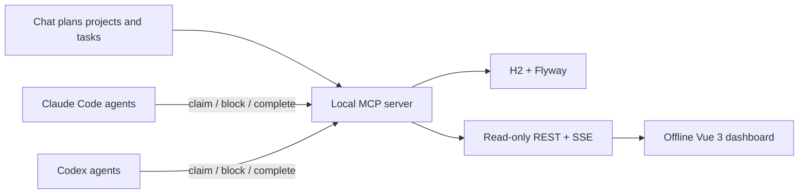

# AI Project Board

> Coordinate parallel Claude Code and Codex agents without duplicate work,
> missed prerequisites, or unverifiable "done" claims. Local-first, no account,
> no cloud.

[Traditional Chinese 繁體中文](README.zh-TW.md) ·
[Latest release](https://github.com/hpigu/AIProjectDashboard/releases/latest) ·
[Installation guide](docs/installation.md) ·
[MCP tools](docs/mcp-tools.md)


AI coding agents are good at implementing a task. Running several sessions at
once introduces a different problem: who should do what next, which work is
blocked, and whether a task was actually verified before it was marked done.

AI Project Board is a local MCP server and browser dashboard for that coordination
loop. Agents claim dependency-ready tasks atomically, report blockers in a
structured form, and attach test and commit evidence when they finish. You watch
every project update live in one browser tab.

## Why use it?

- **No duplicate work.** Concurrent claims use compare-and-swap semantics, so two
  agents cannot receive the same task.
- **Dependencies are enforced.** Blocked tasks are skipped until every prerequisite
  is done; independent work can continue.
- **Done means evidence.** Completion records can include verification results,
  changed files, and a commit reference.
- **Built for parallel sessions.** Claude Code and Codex can work on different
  projects and roles through the same board.
- **Local-first.** The server binds to `127.0.0.1`, stores data in local H2, and
  serves a fully offline web UI with vendored Vue and fonts.
- **Human-readable history.** Every claim, block, status change, and completion is
  visible from the task drawer and live dashboard.

## How it differs from a regular task board

| | AI Project Board | GitHub Projects / Linear / a `TODO.md` |
|---|---|---|
| Agent-safe concurrent claiming | Atomic and built in | Usually client convention |
| Dependency-aware dispatch | Enforced before a task is issued | Usually visual or manual |
| Completion evidence | Structured test, file, and commit fields | Usually free-form comments |
| Agent workflow roles | Leader/worker boundaries and role instructions | External automation required |
| Runtime model | Local MCP server, no account | Hosted service or file polling |

This project is deliberately opinionated. It is a coordination layer for coding
agents, not a general-purpose replacement for a human project-management suite.

## Quick start from source

Requirements: JDK 21. Maven does not need to be installed; the wrapper is
included. The first start downloads Maven dependencies and builds the server.

macOS or Linux:

```bash
git clone https://github.com/hpigu/AIProjectDashboard.git
cd AIProjectDashboard
./bin/board start
```

Windows PowerShell:

```powershell
git clone https://github.com/hpigu/AIProjectDashboard.git
cd AIProjectDashboard
.\bin\board.ps1 start
```

Open <http://127.0.0.1:8080> after the launcher reports that the board is ready.

Platform artifacts are also available in the
[latest release](https://github.com/hpigu/AIProjectDashboard/releases/latest):
macOS arm64/x64 and Linux x64 executable JARs require a matching JDK 21;
the Windows x64 ZIP includes its own Java runtime. Verify downloads against the
release `SHA256SUMS.txt`. See the [installation guide](docs/installation.md) for
the stable-release layouts and update procedure.

## Connect an agent

The server and agent plugin are separate: start the server first, then install or
configure the client integration.

### Codex plugin

```bash
codex plugin marketplace add hpigu/AIProjectDashboard --ref main
codex plugin add ai-project-board@ai-board
```

When prompted, enable the `board` connector. Open a new Codex task after
installation so the role agents and `claim-tasks` skill are loaded.

To update an existing installation, upgrade the `ai-board` marketplace from
the Codex desktop plugin page. CLI users can run
`codex plugin marketplace upgrade ai-board`. Open a new task afterward; you do
not need to install the plugin again.

### Claude Code plugin

From a local clone:

```bash
claude plugin marketplace add /path/to/AIProjectDashboard
claude plugin install ai-project-board@ai-board
```

Reload plugins or restart Claude Code, then install the declared `board`
connector when prompted.

In Claude Desktop, open **Code → Customize → Plugins → AI Project Board** and
click **Update** when a newer version is available. The installation guide also
documents the CLI fallback.

### MCP only

If you only need the tools and do not want the bundled role agents or workflow
skill:

```bash
claude mcp add --transport http board http://127.0.0.1:8080/mcp --scope project
```

For Codex, add this to `~/.codex/config.toml`:

```toml
[mcp_servers.board]
url = "http://127.0.0.1:8080/mcp"
```

The full client setup and update paths are documented in the
[installation and update guide](docs/installation.md).

## Create your first board

The UI is read-only by design; agents perform every write through MCP. Once the
connector is enabled, ask your agent:

```text
Create a project called Checkout Reliability, break it into backend, frontend,
test, infrastructure, and documentation tasks, and record their prerequisites in
AI Project Board.
```

Then, from the repository where the work should happen:

```text
Claim tasks for Checkout Reliability and start the dependency-ready work.
```

The board updates over SSE without a page refresh. The supplied workflow can
dispatch one task per idle role, integrate results through a `dev` branch, and
request a reviewer before the batch reaches `main`.

## What you can see

- A project overview with progress, blocked state, search, filters, and sorting.
- Kanban and dependency-graph views for each project.
- Filters for category, assignee, waiting prerequisites, and claimability.
- Task history, structured blocker details, and completion evidence.
- Optional desktop notifications when a task becomes blocked.
- Live connection state and bilingual zh-TW/English UI.

## Core MCP workflow

| Tool | Purpose |
|---|---|
| `create_project` | Create or find a project by case-insensitive name |
| `create_tasks` | Create 1–50 tasks and declare prerequisites |
| `list_tasks` | Read project progress and task state |
| `claim_next_task` | Atomically claim the first dependency-ready task for a role |
| `block_task` | Record a structured blocker and related tasks |
| `complete_task` | Finish with a summary and verification evidence |

The server currently exposes 16 tools, including leader-only recovery, role,
editing, and archive operations. Their schemas and state transitions are in
[docs/mcp-tools.md](docs/mcp-tools.md).

## Safety model

This is a trusted-user, single-machine product.

- The server binds to `127.0.0.1` by default.
- `/mcp` has **no server-side authentication**. Do not expose it directly to a
  LAN or the public internet.
- Host and Origin validation protects the loopback service against DNS rebinding.
- Worker tool allowlists are client-side guardrails, not server authorization.
- Startup, shutdown, and scheduled H2 backups are built in; restore is explicit
  and preserves the replaced database.

Read [SECURITY.md](SECURITY.md) and the
[operations guide](docs/operations.md) before changing bind or proxy settings.

## Scope and current limitations

- Single machine only; no account, cloud sync, or validated server deployment.
- macOS/Linux release JARs require JDK 21; only the Windows x64 release bundle
  currently includes a Java runtime.
- The agent-facing tool descriptions, role instructions, most backend errors, and
  some reference documents remain Traditional Chinese. The web UI supports zh-TW
  and English.
- Plugin updates have been validated in the Codex and Claude Desktop plugin
  pages. Clean first-time graphical installation still needs an independent
  external-user test; the CLI installation paths remain documented fallbacks.
- Role customizations are stored in the local database and do not travel with the
  thin plugin to another machine.

See the maintained [product roadmap](docs/roadmap.md) for known gaps and explicit
non-goals.

## Architecture



Stack: Java 21, Spring Boot 4.1, Spring AI 2.0 MCP, H2, Flyway, and a zero-build
Vue 3 frontend.

## Documentation

| Document | Contents |
|---|---|
| [Traditional Chinese README](README.zh-TW.md) | Chinese product overview and setup path |
| [Installation](docs/installation.md) | Platform installation, plugins, data paths, and migration |
| [MCP tools](docs/mcp-tools.md) | Complete tool schemas, state machine, and governance |
| [Agent roles](docs/agent-roles.md) | Leader, worker, reviewer, and role instruction model |
| [Operations](docs/operations.md) | Start/stop, backup, restore, diagnostics, troubleshooting |
| [Roadmap](docs/roadmap.md) | Product gaps, decisions, completed work, and non-goals |

## Development

Never use the default production port or database for tests:

```bash
BOARD_PORT=8081 \
BOARD_DB_URL='jdbc:h2:file:./data/dev-local' \
BOARD_LOG_FILE='./logs/dev-local.log' \
./mvnw test
```

Repository-specific agent rules are in [AGENTS.md](AGENTS.md).

## License

[MIT](LICENSE)
